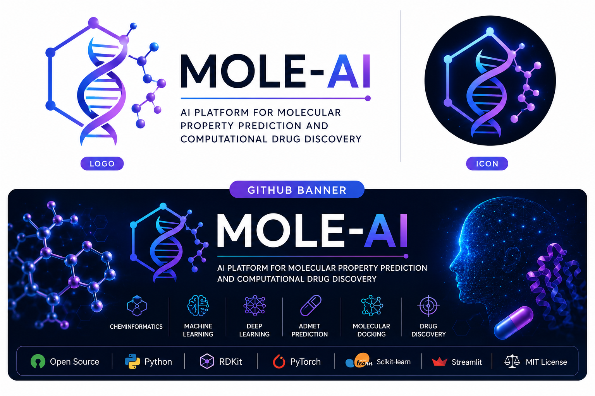
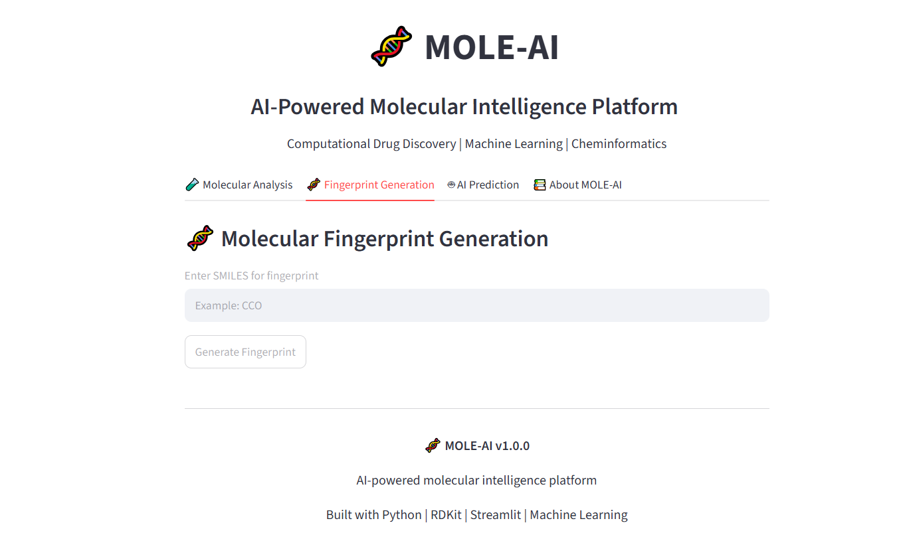

<p align="center">
  
</p>

<h1 align="center">🧬 MOLE-AI</h1>

<h3 align="center">
AI Platform for Molecular Property Prediction and Computational Drug Discovery
</h3>

<p align="center">
Accelerating AI-driven drug discovery through machine learning, cheminformatics, and molecular intelligence.
</p>

<p align="center">


</p>

---

# Overview

**MOLE-AI** is an open-source platform for **AI-powered molecular property prediction and computational drug discovery**.

The project combines **cheminformatics**, **machine learning**, **deep learning**, and **computational chemistry** into a unified framework for developing molecular prediction pipelines, QSAR models, molecular similarity analysis, and drug discovery workflows.

The primary goal of MOLE-AI is to provide researchers, students, and developers with an extensible toolkit for molecular analysis and predictive modeling while promoting reproducible and open scientific research.

---
# 🌐 Interactive Web Application

MOLE-AI includes a Streamlit-based interface for molecular analysis and AI prediction.

Current capabilities:

✅ SMILES-based molecular analysis  
✅ Molecular fingerprint generation  
✅ QSAR-based pIC50 prediction  
✅ Molecular structure visualization  
✅ Prediction history export  


Launch locally:

```bash
streamlit run mole_ai/app.py

# Key Highlights

- 🧬 Molecular preprocessing using RDKit
- 🧪 SMILES validation and molecular analysis
- 📊 Molecular descriptor calculation
- 🧠 Machine Learning (QSAR)
- 🤖 Deep Learning models
- 🕸️ Graph Neural Network foundation
- 🔬 Transformer-based molecular models
- 💊 ADMET prediction utilities
- ⚗️ Molecular optimization
- 🧩 Molecular similarity search
- 📈 Prediction reporting
- 🌐 Interactive Streamlit web interface
- 🧪 Automated testing with pytest
- 📚 Modular Python API
- 🚀 Open-source and extensible architecture

---

# Current Release

## MOLE-AI v1.0.0

The first stable release includes a complete molecular processing pipeline covering:

- Molecular preprocessing
- Descriptor generation
- Fingerprint generation
- Feature engineering
- ChEMBL data processing
- QSAR model training
- Prediction pipeline
- Model evaluation
- Batch prediction
- Prediction reports
- Dataset management
- Molecular similarity search
- Experiment tracking
- Model registry
- Streamlit interface
- Documentation
- Automated testing

---

# 📸 Web Interface Screenshots

MOLE-AI provides an interactive Streamlit interface for molecular analysis and AI-based property prediction.

## 🧪 Molecular Analysis


## 🧬 Fingerprint Generation




## 🤖 AI Prediction


## 📚 About MOLE-AI


# 🚀 Features

MOLE-AI provides a modular collection of tools for molecular analysis, machine learning, and AI-assisted drug discovery.

---

# 🖥️ Streamlit Application Features

MOLE-AI includes an interactive Streamlit web application for molecular analysis and AI-based molecular property prediction.

The interface is organized into four main modules:

---

## 🧪 Tab 1 — Molecular Analysis

Analyze molecules directly from SMILES input.

Features:

- SMILES validation using RDKit
- Molecular structure visualization
- Molecular descriptors calculation
- Drug-likeness properties
- Lipinski rule analysis

---

## 🧬 Tab 2 — Fingerprint Generation

Generate molecular fingerprints for machine learning applications.

Features:

- Morgan fingerprint generation
- 2048-bit molecular representation
- Active fingerprint bit visualization
- Chemical feature encoding

---

## 🤖 Tab 3 — AI Molecular Prediction

Predict molecular activity using the integrated QSAR machine learning model.

## 📚 Tab 4 — About MOLE-AI

Provides an overview of the MOLE-AI platform, including its scientific workflow, technology stack, and future development roadmap.

Includes:

- 🧬 AI-driven drug discovery workflow
- 🧪 Cheminformatics and machine learning pipeline overview
- 🛠 Technology stack information
- 📊 Project architecture overview
- 🗺 Future development roadmap

The About section summarizes how MOLE-AI integrates:

Molecular Input
↓
RDKit Processing
↓
Molecular Features
↓
Machine Learning Models
↓
Property Prediction
↓
Drug Discovery Insights

Features:

- Random Forest regression model
- Morgan fingerprint-based prediction
- pIC50 activity prediction
- Candidate activity classification
- Prediction history tracking
- CSV export of predictions

Workflow:

SMILES
↓
RDKit Molecular Processing
↓
Morgan Fingerprint (2048 bits)
↓
Random Forest QSAR Model
↓
Predicted pIC50

# 🧬 Cheminformatics

| Feature | Description | Status |
|----------|-------------|:------:|
| ✅ SMILES Validation | Validate molecular SMILES strings using RDKit | ✔ |
| ✅ Molecular Parsing | Convert SMILES into RDKit molecule objects | ✔ |
| ✅ Descriptor Calculation | Generate physicochemical descriptors | ✔ |
| ✅ Morgan Fingerprints | Circular fingerprints for molecular representation | ✔ |
| ✅ Molecular Similarity | Tanimoto similarity search | ✔ |
| ✅ Molecular Visualization | Interactive molecular structure display | ✔ |

---

# 🤖 Machine Learning

| Feature | Description | Status |
|----------|-------------|:------:|
| ✅ Feature Engineering | Molecular feature generation pipeline | ✔ |
| ✅ QSAR Modelling | Random Forest regression models | ✔ |
| ✅ Model Training | Train predictive molecular models | ✔ |
| ✅ Batch Prediction | Predict multiple molecules simultaneously | ✔ |
| ✅ Model Evaluation | MAE, RMSE and R² metrics | ✔ |
| ✅ Prediction Reports | Automatic prediction summaries | ✔ |
| ✅ Model Registry | Save and manage trained models | ✔ |

---

# 🤖 QSAR Model

Current prediction engine:

| Component | Description |
|---|---|
| Algorithm | Random Forest Regression |
| Input Features | 2048-bit Morgan Fingerprints |
| Prediction | pIC50 Activity |
| Chemistry Engine | RDKit |
| Model Type | Supervised Machine Learning |


Workflow:

SMILES

↓

RDKit Molecular Processing

↓

Morgan Fingerprint

↓

Random Forest Model

↓

Predicted pIC50

# 🧠 Deep Learning

| Feature | Description | Status |
|----------|-------------|:------:|
| ✅ Feed-forward Neural Networks | Deep QSAR models | ✔ |
| ✅ Graph Neural Network Foundation | Molecular graph learning modules | ✔ |
| ✅ Transformer Models | Transformer-based molecular prediction | ✔ |
| 🔄 Large Language Models | Future integration | Planned |

---

# 💊 Drug Discovery

| Feature | Description | Status |
|----------|-------------|:------:|
| ✅ ADMET Prediction | Drug-likeness utilities | ✔ |
| ✅ Molecular Optimization | Lead optimization tools | ✔ |
| ✅ Molecular Generation | AI-assisted molecule generation | ✔ |
| ✅ Docking Utilities | Docking workflow support | ✔ |
| ✅ Candidate Ranking | Rank compounds by predicted performance | ✔ |
| ✅ ChEMBL Processing | Dataset preprocessing pipeline | ✔ |

---

# 🌐 User Interface

| Feature | Description | Status |
|----------|-------------|:------:|
| ✅ Streamlit Application | Interactive web interface | ✔ |
| ✅ Python API | Easy integration into Python projects | ✔ |
| ✅ Command-Line Interface | Terminal-based workflows | ✔ |
| ✅ Modular Package Design | Reusable Python modules | ✔ |

---

# 📊 Current Capabilities

MOLE-AI currently supports the complete workflow below:

```text
SMILES Input
      │
      ▼
Validation
      │
      ▼
Descriptor Generation
      │
      ▼
Fingerprint Generation
      │
      ▼
Feature Engineering
      │
      ▼
Machine Learning Prediction
      │
      ▼
Model Evaluation
      │
      ▼
Prediction Report
```

---

# ⭐ Why MOLE-AI?

MOLE-AI was designed with the following principles:

- 🧬 Modular architecture
- ⚡ Fast molecular preprocessing
- 🤖 AI-first drug discovery workflows
- 🔬 Reproducible computational research
- 📚 Open-source development
- 🧪 Extensible machine learning pipelines
- 🌐 Interactive web interface
- 📦 Easy integration into existing research projects

---

# 📈 Project Statistics

| Metric | Value |
|---------|------:|
| Programming Language | Python 3.11+ |
| Core Cheminformatics Library | RDKit |
| Machine Learning Framework | Scikit-learn |
| Deep Learning Framework | PyTorch |
| Web Framework | Streamlit |
| Documentation | Markdown |
| Testing Framework | Pytest |
| License | MIT |
| Current Release | v1.0.0 |

---
# 🏗️ System Architecture

MOLE-AI follows a modular architecture that separates molecular preprocessing, feature engineering, machine learning, deep learning, and drug discovery utilities into reusable components.

The platform is designed to be scalable, allowing researchers to extend individual modules without affecting the rest of the system.

---

# 🧬 Overall Architecture

```text
                          ┌───────────────────────┐
                          │       User/API        │
                          └──────────┬────────────┘
                                     │
                     ┌───────────────┴───────────────┐
                     │                               │
              Streamlit App                   Command Line Interface
                     │                               │
                     └───────────────┬───────────────┘
                                     │
                           Python API Layer
                                     │
        ┌────────────────────────────┼────────────────────────────┐
        │                            │                            │
        ▼                            ▼                            ▼
 Chemistry Module            Feature Engineering          Machine Learning
        │                            │                            │
        ▼                            ▼                            ▼
 Descriptors                  Molecular Features          QSAR Models
 Fingerprints                 Dataset Processing          Model Training
 SMILES Validation            ChEMBL Pipeline             Prediction
        │                            │                            │
        └────────────────────────────┼────────────────────────────┘
                                     │
                                     ▼
                           Drug Discovery Modules
                                     │
        ┌───────────────┬───────────────┬───────────────┐
        ▼               ▼               ▼               ▼
     ADMET       Similarity Search  Docking      Optimization
                                     │
                                     ▼
                           Prediction Reports
                                     │
                                     ▼
                              Final Results
```

---

# 📂 Project Modules

MOLE-AI is organized into independent modules.

| Module | Purpose |
|---------|----------|
| **chem** | Molecular preprocessing and cheminformatics |
| **features** | Feature engineering and descriptor pipelines |
| **models** | Machine learning and deep learning models |
| **data** | Dataset loading and processing |
| **examples** | Example workflows |
| **tests** | Automated unit testing |
| **docs** | Documentation |
| **app.py** | Streamlit web application |
| **cli.py** | Command-line interface |

---

# 🔬 Drug Discovery Pipeline

```text
Input SMILES
      │
      ▼
SMILES Validation
      │
      ▼
RDKit Molecule
      │
      ▼
Descriptor Generation
      │
      ▼
Morgan Fingerprints
      │
      ▼
Feature Engineering
      │
      ▼
Machine Learning Models
      │
      ▼
Deep Learning Models
      │
      ▼
Property Prediction
      │
      ▼
ADMET Prediction
      │
      ▼
Similarity Search
      │
      ▼
Docking Utilities
      │
      ▼
Lead Optimization
      │
      ▼
Prediction Report
```

---

# 🔄 Data Flow

The figure below summarizes the complete data flow implemented in MOLE-AI.

```text
SMILES
   │
   ▼
RDKit
   │
   ▼
Descriptors
   │
   ▼
Fingerprints
   │
   ▼
Feature Matrix
   │
   ▼
Machine Learning
   │
   ▼
Prediction
   │
   ▼
Evaluation
   │
   ▼
Visualization
```

---

# 📦 Software Design Principles

MOLE-AI has been developed following modern software engineering practices.

- ✅ Modular architecture
- ✅ Reusable components
- ✅ Object-oriented design
- ✅ Python package structure
- ✅ Automated testing
- ✅ Documentation-first development
- ✅ Scalable project organization
- ✅ Easy integration with external tools

---

# 🎯 Design Goals

The architecture was designed to support:

- AI-assisted drug discovery
- Molecular property prediction
- Reproducible computational workflows
- Educational bioinformatics projects
- Future deep learning extensions
- Open-source community contributions

---
# ⚙️ Installation

## System Requirements

MOLE-AI has been tested with the following environment.

| Requirement | Version |
|-------------|---------|
| Python | 3.11+ |
| Conda | Latest |
| RDKit | Latest |
| Streamlit | Latest |
| Scikit-learn | Latest |
| PyTorch | Latest |

---

# 📥 Clone Repository

```bash
git clone https://github.com/Mehwish55/MOLE-AI.git

cd MOLE-AI
```

---

# 🐍 Create Conda Environment

```bash
conda create -n mole-ai python=3.11

conda activate mole-ai
```

---

# 📦 Install Dependencies

```bash
pip install -r requirements.txt
```

---

# ✅ Verify Installation

Run:

```bash
pytest -v
```

If all tests pass successfully, MOLE-AI has been installed correctly.

---

# 🚀 Quick Start

The simplest way to use MOLE-AI is through the Python API.

```python
from mole_ai.chem.smiles import validate_smiles

print(validate_smiles("CCO"))
```

Output

```text
True
```

---

# 🧬 Python API

Validate a SMILES string

```python
from mole_ai.chem.smiles import validate_smiles

validate_smiles("CCO")
```

Generate molecular descriptors

```python
from mole_ai.chem.descriptors import calculate_descriptors

calculate_descriptors("CCO")
```

Generate Morgan fingerprints

```python
from mole_ai.chem.fingerprints import generate_morgan_fingerprint

generate_morgan_fingerprint("CCO")
```

Predict molecular properties

```python
from mole_ai.models.predict import predict

predictions = predict(
    model="models/model.pkl",
    input_data="data/features.csv",
)

print(predictions)
```

---

# 💻 Command-Line Interface

Display the installed version.

```bash
python -m mole_ai.cli --version
```

Run molecular prediction.

```bash
python -m mole_ai.cli \
    --predict \
    --model models/model.pkl \
    --input data/features.csv \
    --output predictions.csv
```

---

# 🌐 Streamlit Web Interface

MOLE-AI includes an interactive Streamlit application for molecular property prediction.

Launch the application

```bash
streamlit run mole_ai/app.py
```

Open your browser

```text
http://localhost:8501
```

---

# 🖥️ Web Interface Features

The Streamlit application currently supports:

- ✅ SMILES input
- ✅ Molecular validation
- ✅ Property prediction
- ✅ Prediction summary
- ✅ Interactive interface

---

# 📸 Web Interface Preview

> **Screenshot coming soon**

After launching the application you can enter a molecular SMILES string such as:

```text
CCO
```

The application validates the molecule and returns prediction results through an interactive interface.

---

# 📁 Example Files

The repository includes example scripts demonstrating common workflows.

```text
examples/

build_features.py

prediction_example.py

training_example.py
```

---

# 🔬 Typical Workflow

```text
Clone Repository

↓

Install Dependencies

↓

Prepare Dataset

↓

Generate Features

↓

Train Model

↓

Evaluate Model

↓

Predict Properties

↓

Generate Reports

↓

Visualize Results
```

---

# ⚡ Performance

Current implementation supports:

- Molecular preprocessing
- Descriptor generation
- Fingerprint calculation
- QSAR prediction
- Batch prediction
- Prediction reports
- Molecular similarity
- Interactive web interface

The modular design allows future expansion with additional machine learning models and drug discovery workflows.

---
# 📂 Project Structure

The repository follows a modular architecture designed for scalability, maintainability, and reproducible computational research.

```text
MOLE-AI/
│
├── assets/
│   └── images/
│       ├── logo.png
│       └── github-banner.png
│
├── data/
│   ├── raw/
│   ├── processed/
│   └── external/
│
├── docs/
│   ├── index.md
│   ├── api.md
│   ├── user_guide.md
│   └── workflow.md
│
├── examples/
│   ├── build_features.py
│   ├── prediction_example.py
│   └── training_example.py
│
├── mole_ai/
│   ├── chem/
│   │   ├── descriptors.py
│   │   ├── fingerprints.py
│   │   └── smiles.py
│   │
│   ├── data/
│   │
│   ├── features/
│   │
│   ├── models/
│   │   ├── train.py
│   │   ├── predict.py
│   │   ├── evaluate.py
│   │   ├── registry.py
│   │   ├── tuning.py
│   │   ├── explainability.py
│   │   ├── graph_neural_network.py
│   │   ├── transformer.py
│   │   ├── admet.py
│   │   ├── optimization.py
│   │   └── docking.py
│   │
│   ├── app.py
│   └── cli.py
│
├── notebooks/
│
├── tests/
│
├── requirements.txt
├── pyproject.toml
├── LICENSE
└── README.md
```

---

# 📦 Package Organization

| Directory | Description |
|------------|-------------|
| **assets/** | Images, logos, and project branding |
| **data/** | Raw, processed, and external datasets |
| **docs/** | Project documentation |
| **examples/** | Example scripts and tutorials |
| **mole_ai/** | Core Python package |
| **notebooks/** | Jupyter notebooks |
| **tests/** | Automated unit tests |
| **requirements.txt** | Python dependencies |
| **pyproject.toml** | Project configuration |
| **README.md** | Project overview |

---

# 🧩 Core Modules

## 🧬 Chemistry Module

Responsible for molecular preprocessing.

Functions include:

- SMILES validation
- RDKit molecule conversion
- Molecular descriptors
- Morgan fingerprints
- Similarity calculations

---

## 📊 Feature Engineering

Responsible for preparing machine learning inputs.

Includes:

- Descriptor extraction
- Fingerprint generation
- Feature matrices
- Dataset preparation
- ChEMBL preprocessing

---

## 🤖 Machine Learning

Implements predictive models.

Includes:

- Random Forest
- Model training
- Model evaluation
- Batch prediction
- Prediction reports
- Hyperparameter tuning

---

## 🧠 Deep Learning

Provides neural-network-based models.

Includes:

- Feed-forward neural networks
- Graph neural network foundation
- Transformer models

---

## 💊 Drug Discovery

Utilities supporting molecular design.

Includes:

- ADMET prediction
- Docking utilities
- Molecular optimization
- Candidate ranking
- Similarity search

---

## 🌐 User Interfaces

Two interfaces are available.

### Python API

Designed for researchers and developers.

### Streamlit Application

Designed for interactive molecular prediction.

---

# 📊 Development Statistics

| Category | Status |
|-----------|--------|
| Python Package | ✅ |
| RDKit Integration | ✅ |
| Machine Learning | ✅ |
| Deep Learning | ✅ |
| Documentation | ✅ |
| Unit Testing | ✅ |
| GitHub Release | ✅ |
| Streamlit Interface | ✅ |
| CLI Support | ✅ |

---

# 🧪 Testing

The project uses **pytest** for automated testing.

Current coverage includes:

- Molecular preprocessing
- Descriptor calculation
- Fingerprint generation
- Feature engineering
- Model training
- Prediction
- Evaluation
- Reporting
- Dataset utilities
- Similarity search

Run all tests:

```bash
pytest -v
```

Run an individual test:

```bash
pytest tests/test_predict.py -v
```

---

# 📚 Documentation

Project documentation is available in the **docs/** directory.

```text
docs/

├── index.md
├── api.md
├── workflow.md
└── user_guide.md
```

Documentation includes:

- Installation Guide
- User Guide
- API Reference
- Workflow Documentation

---

# 📈 Development Philosophy

MOLE-AI has been developed with the following goals:

- Modular architecture
- Reusable Python components
- Reproducible computational workflows
- Open-source collaboration
- Extensible AI framework
- Educational usability
- Production-ready project organization

---
# 🛠️ Technologies

MOLE-AI is built using a modern scientific Python ecosystem for computational chemistry, machine learning, and bioinformatics.

## Programming Language

- Python 3.11+

## Cheminformatics

- RDKit

## Machine Learning

- Scikit-learn
- NumPy
- Pandas

## Deep Learning

- PyTorch
- PyTorch Geometric *(foundation for future graph-based models)*

## Data Processing

- ChEMBL
- PubChem
- Protein Data Bank (PDB)

## Visualization

- Streamlit
- Matplotlib

## Development

- Git
- GitHub
- Pytest
- Conda

---

# 📚 Datasets

MOLE-AI is designed to work with publicly available molecular datasets.

Supported datasets include:

- ChEMBL
- PubChem
- Protein Data Bank (PDB)

Typical applications include:

- QSAR modelling
- Molecular property prediction
- Feature engineering
- Molecular similarity analysis
- Drug discovery research

---

# 🧪 Quality Assurance

The project follows software engineering best practices.

- ✅ Modular architecture
- ✅ Version control using Git
- ✅ Automated unit testing
- ✅ Reproducible workflows
- ✅ Open-source development
- ✅ Continuous documentation

---

# 🗺️ Roadmap

The following features are planned for future releases.

## Version 1.1

- Enhanced Streamlit dashboard
- Molecular visualization
- Improved prediction reports
- Additional QSAR algorithms

---

## Version 1.2

- Advanced Graph Neural Networks
- Transformer fine-tuning
- Additional molecular descriptors
- Model comparison dashboard

---

## Version 2.0

- Large molecular foundation models
- AI-assisted molecular generation
- Multi-objective optimization
- Cloud deployment
- REST API
- Docker support
- Interactive molecular visualization
- Automated benchmarking

---

# 🤝 Contributing

Contributions are welcome.

If you would like to contribute:

1. Fork the repository

2. Clone your fork

```bash
git clone https://github.com/<your-username>/MOLE-AI.git
```

3. Create a feature branch

```bash
git checkout -b feature/new-feature
```

4. Commit your changes

```bash
git commit -m "Add new feature"
```

5. Push your branch

```bash
git push origin feature/new-feature
```

6. Open a Pull Request

Please ensure that:

- Code follows project style
- Tests pass successfully
- Documentation is updated where appropriate

---

# 📖 Citation

If you use MOLE-AI in your research, teaching, or publications, please cite this repository.

```text
Shafiq, M.

MOLE-AI:
An Open-Source Platform for Molecular Property Prediction
and Computational Drug Discovery.

GitHub Repository.

https://github.com/Mehwish55/MOLE-AI
```

A formal citation (e.g., DOI via Zenodo) may be added in future releases.

---

# 📄 License

This project is licensed under the MIT License.

See the LICENSE file for additional information.

---

# 🙋 About the Author

**Mehwish Shafiq**

Computational Biologist | Bioinformatics Researcher | AI for Drug Discovery

Research interests include:

- Computational Drug Discovery
- Bioinformatics
- Machine Learning
- Artificial Intelligence
- Molecular Property Prediction
- Multi-Objective Drug Design
- Computational Biology

---

# 📬 Contact

For questions, feature requests, or collaboration opportunities:

- Open a GitHub Issue
- Submit a Pull Request
- Connect through GitHub

Repository:

https://github.com/Mehwish55/MOLE-AI

---

# ⭐ Support the Project

If you find MOLE-AI useful:

- ⭐ Star the repository
- 🍴 Fork the project
- 🧪 Try the examples
- 📝 Report bugs
- 💡 Suggest new features
- 🤝 Contribute improvements

Your support helps improve the project and encourages future development.

---

# 🎯 Project Vision

MOLE-AI aims to provide an open, modular, and extensible platform that bridges computational chemistry, bioinformatics, and artificial intelligence.

The long-term vision is to support researchers, students, and developers in accelerating molecular discovery through reproducible, AI-driven workflows.

---

<p align="center">

**🧬 MOLE-AI**

*Accelerating AI-driven Drug Discovery*

Made with ❤️ using Python, RDKit, Machine Learning, and Open Science.

</p>
